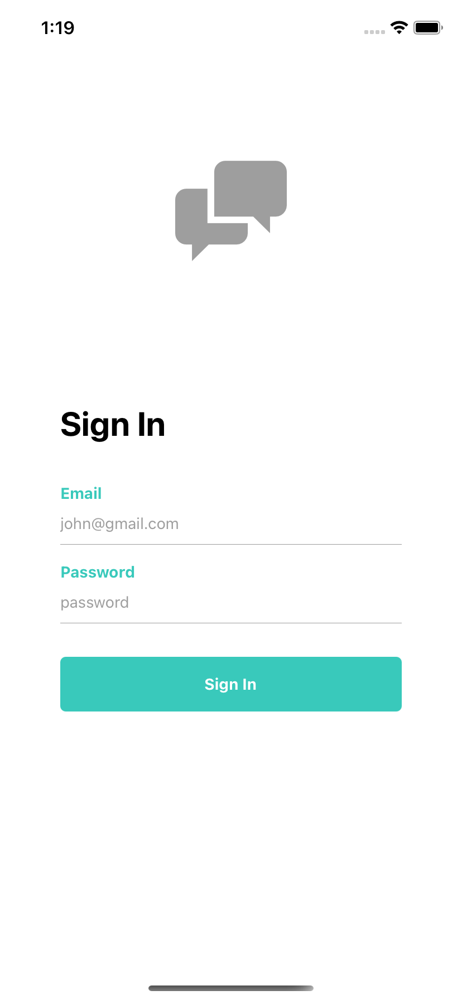
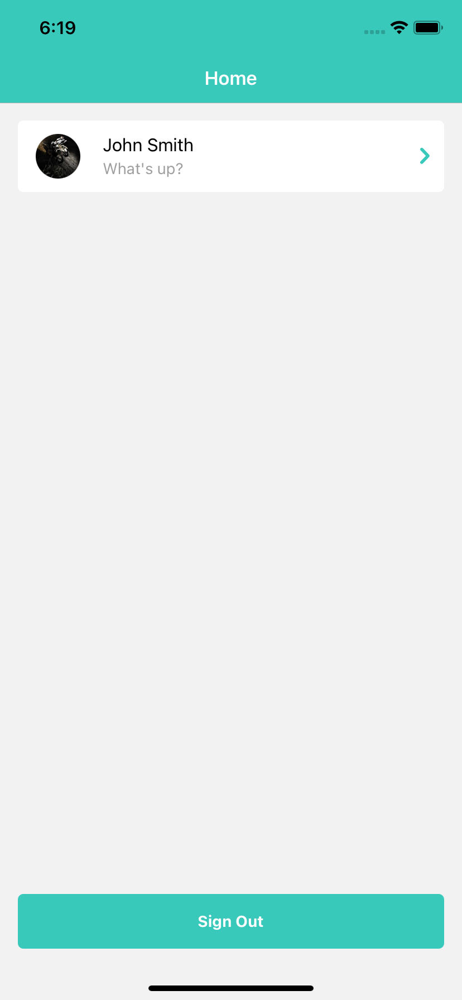
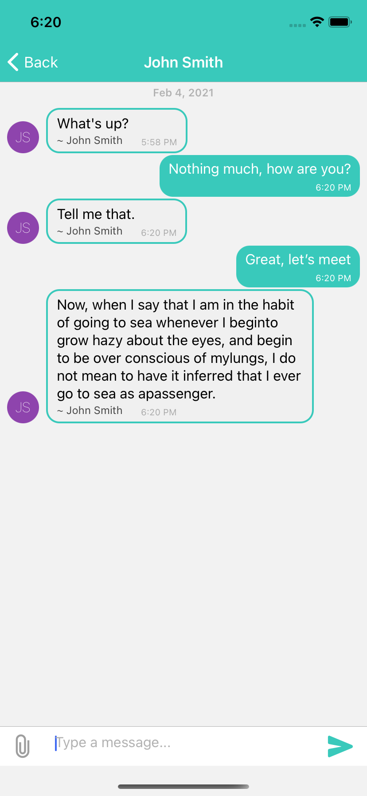

# Chat Application

## About The Project

A mock chat application using React Native, Redux and React Native Gifted Chat. The chat feature includes the capability to send and receive texts, images and pdf files.

Screenshot on iOS device:

<p align="center" >



</p>

### Built With

- [React Native](https://reactnative.dev)
- [Redux](https://redux.js.org)
- [React Native Gifted Chat](https://github.com/FaridSafi/react-native-gifted-chat)

## Getting Started

To get a local copy up and running follow these simple steps.

### Prerequisites

- npm
  ```sh
  npm install npm@latest -g
  ```
- yarn
  ```sh
  npm install --global yarn
  ```

### Running the example

1. Clone the repo
   ```sh
   git clone https://github.com/IlifilzaRusli/chat-app.git
   ```
2. Navigate to the directory
   ```sh
   cd chat-ap
   ```
3. Install packages
   ```sh
   yarn
   ```
4. [iOS] Install pods
   ```sh
   cd ios && pod install && cd ..
   ```
5. Run the application
   ```sh
   react-native run-ios OR react-native run-android
   ```
6. Sign in the app (using dummy data)
   ```sh
   email: test@user.com
   password: password
   ```

## License

Distributed under the MIT License. See `LICENSE` for more information.
